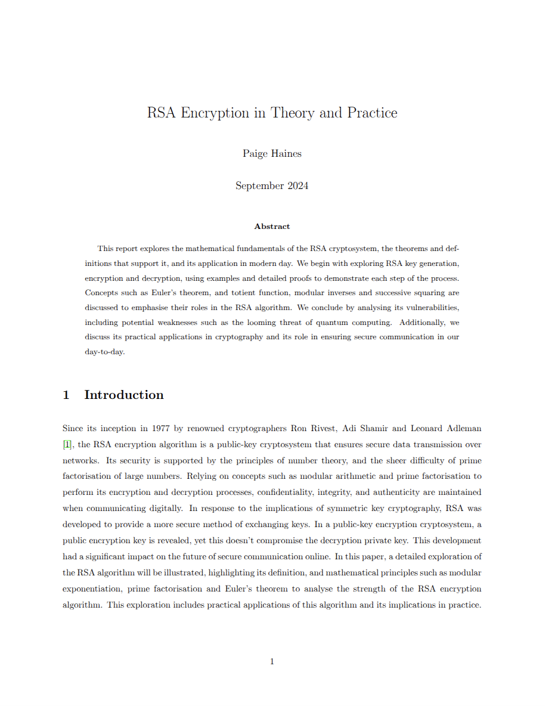
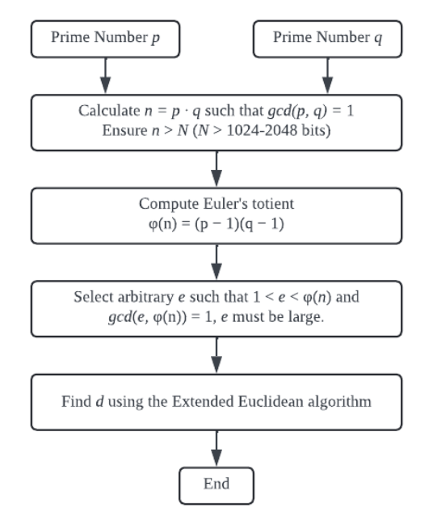
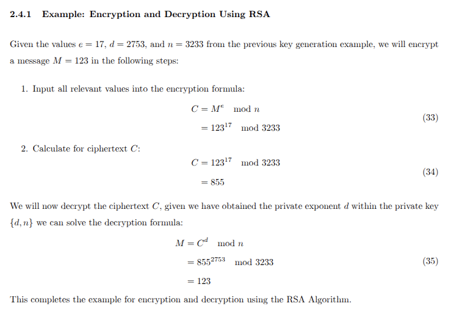
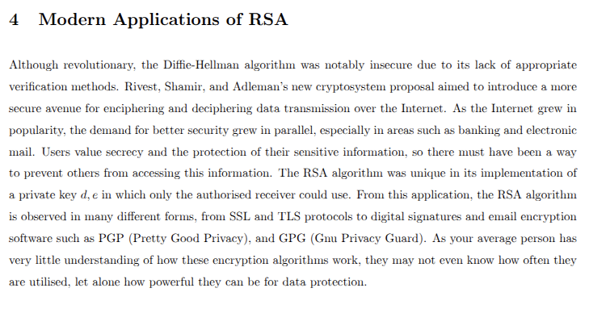
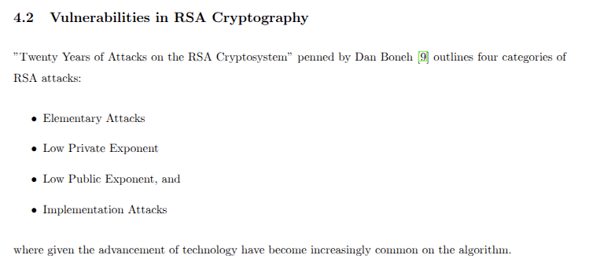

# Understanding the RSA Cryptosystem

This report provides an in-depth exploration of the **RSA cryptosystem**, a cornerstone of modern public-key cryptography. Aimed at readers with a foundational understanding of number theory, the document explains the mathematics behind RSA, its real-world applications, and its vulnerabilities in the evolving landscape of cybersecurity.

## 📚 Overview

The report is structured to guide readers from the basics of modular arithmetic to the implications of quantum computing on RSA. Along the way, it introduces and explains key concepts through definitions, theorems, algorithms, and practical examples.

### Topics Covered

- **Mathematical Fundamentals**
  - Modular Arithmetic
  - Prime Numbers
  - Euler's Totient Function
  - Greatest Common Divisor (GCD)
  - Bézout's Lemma
- **RSA Key Generation**
  - Step-by-step key generation
  - Euclidean Algorithm
  - Extended Euclidean Algorithm
- **Encryption and Decryption**
  - Worked example using RSA
- **Correctness and Efficiency**
  - Proof of correctness
  - Successive squaring for performance
- **Applications of RSA**
  - TLS/SSL protocols
  - Digital signatures
  - Secure email encryption
- **Security and Vulnerabilities**
  - Integer factorisation
  - Shor’s Algorithm (quantum computing)
  - Common attack vectors

## 📷 Preview

Here are a few snapshots from the report:

### Cover Page

  

### RSA Key Generation Flow

  

### Worked Example: Encryption & Decryption

  

### Applications of RSA

  

### RSA Vulnerabilities Overview

  

